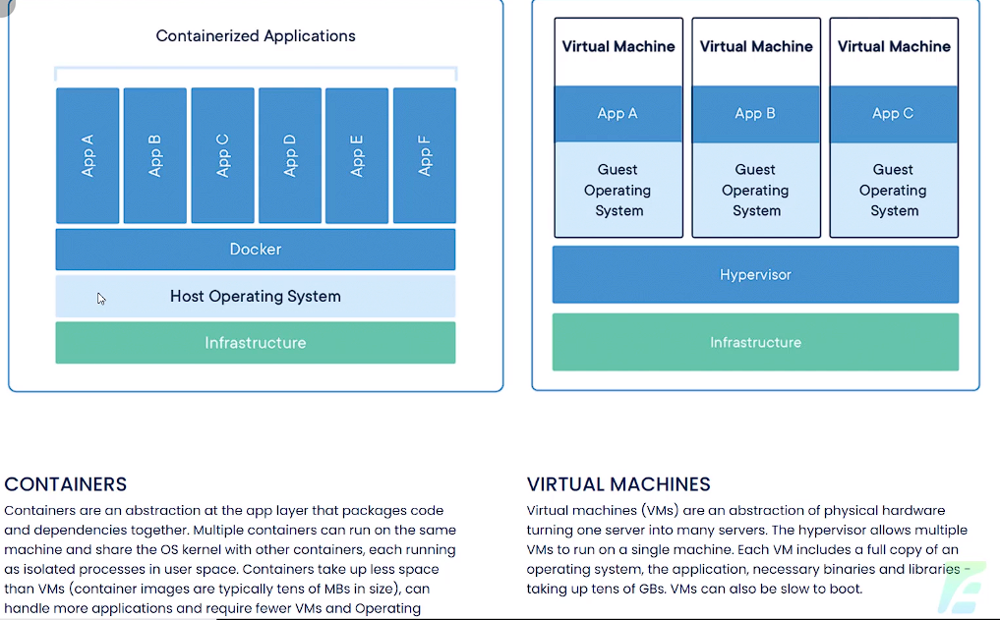

# CURSO DE DOCKER

https://academy.especializati.com.br/curso/docker

NESSE CURSO VOCÊ VAI APRENDER DE UMA VEZ POR TODAS COMO TRABALHAR COM O DOCKER, COMO CRIAR CONTAINERS E MUITO MAIS.

## <a name="indice">Índice</a>

1. [01 - Intro ao Docker](#parte1)     
2. [02 - Docker na Prática](#parte2)     
3. [03 - Dockerfile](#parte3)     
4. [04 - Docker Compose](#parte4)     
---


## <a name="parte1">01 - Intro ao Docker</a>

01 - O que é o Docker



02 - Ferramentas para o Curso de Docker

- https://docs.docker.com/desktop/windows/install/

03 - Conhecendo o Docker Hub

- https://hub.docker.com/

[Voltar ao Índice](#indice)

---


## <a name="parte2">02 - Docker na Prática</a>

01 - Iniciando com o Docker

```text
$ docker --help

Usage:  docker [OPTIONS] COMMAND

A self-sufficient runtime for containers

Options:
      --config string      Location of client config files (default
                           "C:\\Users\\josem\\.docker")
  -c, --context string     Name of the context to use to connect to the
                           daemon (overrides DOCKER_HOST env var and
                           default context set with "docker context use")
  -D, --debug              Enable debug mode
  -H, --host list          Daemon socket(s) to connect to
  -l, --log-level string   Set the logging level
                           ("debug"|"info"|"warn"|"error"|"fatal")
                           (default "info")
      --tls                Use TLS; implied by --tlsverify
      --tlscacert string   Trust certs signed only by this CA (default
                           "C:\\Users\\josem\\.docker\\ca.pem")
      --tlscert string     Path to TLS certificate file (default
                           "C:\\Users\\josem\\.docker\\cert.pem")
      --tlskey string      Path to TLS key file (default
                           "C:\\Users\\josem\\.docker\\key.pem")
      --tlsverify          Use TLS and verify the remote
  -v, --version            Print version information and quit

Management Commands:
  builder     Manage builds
  buildx*     Docker Buildx (Docker Inc., v0.7.1)
  compose*    Docker Compose (Docker Inc., v2.2.1)
  config      Manage Docker configs
  container   Manage containers
  context     Manage contexts
  image       Manage images
  manifest    Manage Docker image manifests and manifest lists
  network     Manage networks
  node        Manage Swarm nodes
  plugin      Manage plugins
  scan*       Docker Scan (Docker Inc., 0.9.0)
  secret      Manage Docker secrets
  service     Manage services
  stack       Manage Docker stacks
  swarm       Manage Swarm
  system      Manage Docker
  trust       Manage trust on Docker images
  volume      Manage volumes

Commands:
  attach      Attach local standard input, output, and error streams to a running container   
  build       Build an image from a Dockerfile
  commit      Create a new image from a container's changes
  cp          Copy files/folders between a container and the local filesystem
  create      Create a new container
  diff        Inspect changes to files or directories on a container's filesystem
  events      Get real time events from the server
  exec        Run a command in a running container
  export      Export a container's filesystem as a tar archive
  history     Show the history of an image
  images      List images
  import      Import the contents from a tarball to create a filesystem image
  info        Display system-wide information
  inspect     Return low-level information on Docker objects
  kill        Kill one or more running containers
  load        Load an image from a tar archive or STDIN
  login       Log in to a Docker registry
  logout      Log out from a Docker registry
  logs        Fetch the logs of a container
  pause       Pause all processes within one or more containers
  port        List port mappings or a specific mapping for the container
  ps          List containers
  pull        Pull an image or a repository from a registry
  push        Push an image or a repository to a registry
  rename      Rename a container
  restart     Restart one or more containers
  rm          Remove one or more containers
  rmi         Remove one or more images
  run         Run a command in a new container
  save        Save one or more images to a tar archive (streamed to STDOUT by default)        
  search      Search the Docker Hub for images
  start       Start one or more stopped containers
  stats       Display a live stream of container(s) resource usage statistics
  stop        Stop one or more running containers
  tag         Create a tag TARGET_IMAGE that refers to SOURCE_IMAGE
  top         Display the running processes of a container
  unpause     Unpause all processes within one or more containers
  update      Update configuration of one or more containers
  version     Show the Docker version information
  wait        Block until one or more containers stop, then print their exit codes

Run 'docker COMMAND --help' for more information on a command.

To get more help with docker, check out our guides at https://docs.docker.com/go/guides/ 
```

```text
$ docker pull hello-world
Using default tag: latest
latest: Pulling from library/hello-world
2db29710123e: Pull complete
Digest: sha256:cc15c5b292d8525effc0f89cb299f1804f3a725c8d05e158653a563f15e4f685
Status: Downloaded newer image for hello-world:latest
docker.io/library/hello-world:latest
```

```text
λ docker images
REPOSITORY    TAG       IMAGE ID       CREATED        SIZE
hello-world   latest    feb5d9fea6a5   2 months ago   13.3kB
```

```text
λ docker run hello-world

Hello from Docker!
This message shows that your installation appears to be working correctly.

To generate this message, Docker took the following steps:
 1. The Docker client contacted the Docker daemon.
 2. The Docker daemon pulled the "hello-world" image from the Docker Hub.
    (amd64)
 3. The Docker daemon created a new container from that image which runs the
    executable that produces the output you are currently reading.
 4. The Docker daemon streamed that output to the Docker client, which sent it
    to your terminal.

To try something more ambitious, you can run an Ubuntu container with:
 $ docker run -it ubuntu bash

Share images, automate workflows, and more with a free Docker ID:
 https://hub.docker.com/

For more examples and ideas, visit:
 https://docs.docker.com/get-started/
```

```text
λ docker ps
CONTAINER ID   IMAGE     COMMAND   CREATED   STATUS    PORTS     NAMES

```

```text
λ docker ps -a
CONTAINER ID   IMAGE         COMMAND    CREATED         STATUS                     PORTS     NAMES
cf459cb37b28   hello-world   "/hello"   2 minutes ago   Exited (0) 2 minutes ago             condescending_swartz

```

02 - Rodar Comandos dentro de um container Docker

```text
λ docker run ubuntu
Unable to find image 'ubuntu:latest' locally
latest: Pulling from library/ubuntu
7b1a6ab2e44d: Pull complete
Digest: sha256:626ffe58f6e7566e00254b638eb7e0f3b11d4da9675088f4781a50ae288f3322
Status: Downloaded newer image for ubuntu:latest
```

```text
λ docker run -it ubuntu ls
bin   dev  home  lib32  libx32  mnt  proc  run   srv  tmp  var
boot  etc  lib   lib64  media   opt  root  sbin  sys  usr

```

```text
λ docker run -it ubuntu bash
root@86c76e7bd106:/# ls
bin  boot  dev  etc  home  lib  lib32  lib64  libx32  media  mnt  opt  proc  root  run  sbin  srv  sys  tmp  usr  var
root@86c76e7bd106:/#
```

03 - Acessar container Docker

```text
λ docker ps
CONTAINER ID   IMAGE     COMMAND   CREATED   STATUS    PORTS     NAMES

λ docker run -itd ubuntu
3379a47c9376ae638284c07e9f91e4d85805cfd636761431e4d*******

λ docker ps
CONTAINER ID   IMAGE     COMMAND   CREATED         STATUS         PORTS     NAMES
3379a47c9376   ubuntu    "bash"    6 seconds ago   Up 2 seconds             quizzical_brahmagupta
```

```text
λ docker run -itd ubuntu
c93cebdd139628650e75157474ed25e872e58d4026dc2b2f58026********

λ docker ps
CONTAINER ID   IMAGE     COMMAND   CREATED          STATUS          PORTS     NAMES
c93cebdd1396   ubuntu    "bash"    20 seconds ago   Up 16 seconds             epic_sinoussi
3379a47c9376   ubuntu    "bash"    4 minutes ago    Up 4 minutes              quizzical_brahmagupta

```

```text
λ docker exec -it c93 bash
root@c93cebdd1396:/# ls -a
.  ..  .dockerenv  bin  boot  dev  etc  home  lib  lib32  lib64  libx32  media  mnt  opt  proc  root  run  sbin  srv  sys  tmp  usr  var root@c93cebdd1396:/# exit
exit
```

```text
λ docker ps
CONTAINER ID   IMAGE     COMMAND   CREATED         STATUS         PORTS     NAMES
c93cebdd1396   ubuntu    "bash"    3 minutes ago   Up 3 minutes             epic_sinoussi
3379a47c9376   ubuntu    "bash"    7 minutes ago   Up 7 minutes             quizzical_brahmagupta

λ docker stop c93
c93

λ docker ps
CONTAINER ID   IMAGE     COMMAND   CREATED         STATUS         PORTS     NAMES
3379a47c9376   ubuntu    "bash"    7 minutes ago   Up 7 minutes             quizzical_brahmagupta

λ docker stop 337
337

λ docker ps
CONTAINER ID   IMAGE     COMMAND   CREATED   STATUS    PORTS     NAMES

λ docker ps -a
CONTAINER ID   IMAGE         COMMAND    CREATED          STATUS                      PORTS     NAMES
c93cebdd1396   ubuntu        "bash"     4 minutes ago    Exited (0) 42 seconds ago             epic_sinoussi
3379a47c9376   ubuntu        "bash"     8 minutes ago    Exited (0) 6 seconds ago              quizzical_brahmagupta
86c76e7bd106   ubuntu        "bash"     12 minutes ago   Exited (0) 9 minutes ago              ecstatic_dewdney
39b76ecbd594   ubuntu        "ls"       20 minutes ago   Exited (0) 20 minutes ago             reverent_clarke
47c9cf1068b3   ubuntu        "bash"     23 minutes ago   Exited (0) 23 minutes ago             trusting_hofstadter
cf459cb37b28   hello-world   "/hello"   11 hours ago     Exited (0) 11 hours ago               condescending_swartz

```

04 - Excluir Containers e Imagens Docker

```text
$ docker rm 337
337

$ docker rm 337
337

$ docker ps -a
CONTAINER ID   IMAGE         COMMAND    CREATED          STATUS                      PORTS     NAMES
86c76e7bd106   ubuntu        "bash"     18 minutes ago   Exited (0) 15 minutes ago             ecstatic_dewdney
39b76ecbd594   ubuntu        "ls"       26 minutes ago   Exited (0) 26 minutes ago             reverent_clarke
47c9cf1068b3   ubuntu        "bash"     29 minutes ago   Exited (0) 29 minutes ago             trusting_hofstadter
cf459cb37b28   hello-world   "/hello"   11 hours ago     Exited (0) 11 hours ago               condescending_swartz

```

```text
λ docker images
REPOSITORY    TAG       IMAGE ID       CREATED        SIZE
ubuntu        latest    ba6acccedd29   7 weeks ago    72.8MB
hello-world   latest    feb5d9fea6a5   2 months ago   13.3kB

λ docker rmi feb5d9fea6a5
Untagged: hello-world:latest
Untagged: hello-world@sha256:cc15c5b292d8525effc0f89cb299f1804f3a725c8d05e158653a563f15e4f685
Deleted: sha256:feb5d9fea6a5e9606aa995e879d862b825965ba48de054caab5ef356dc6b3412
Deleted: sha256:e07ee1baac5fae6a26f30cabfe54a36d3402f96afda318fe0a96cec4ca393359

λ docker images
REPOSITORY   TAG       IMAGE ID       CREATED       SIZE
ubuntu       latest    ba6acccedd29   7 weeks ago   72.8MB
```

05 - Alterando o Status de Containers Docker

```text
λ docker ps
CONTAINER ID   IMAGE     COMMAND   CREATED   STATUS    PORTS     NAMES

λ docker run -itd ubuntu
dad495a5c3899882166267f00bf6fbed85d3fbe84341a9ba352f1da7b23abfb9

λ docker ps
CONTAINER ID   IMAGE     COMMAND   CREATED         STATUS         PORTS     NAMES
dad495a5c389   ubuntu    "bash"    9 seconds ago   Up 4 seconds             pensive_brattain

λ docker restart dad
dad

λ docker ps
CONTAINER ID   IMAGE     COMMAND   CREATED          STATUS         PORTS     NAMES
dad495a5c389   ubuntu    "bash"    56 seconds ago   Up 8 seconds             pensive_brattain

λ docker stop dad
dad

λ docker ps
CONTAINER ID   IMAGE     COMMAND   CREATED   STATUS    PORTS     NAMES

λ docker ps -a
CONTAINER ID   IMAGE     COMMAND   CREATED         STATUS                      PORTS     NAMES
dad495a5c389   ubuntu    "bash"    2 minutes ago   Exited (0) 37 seconds ago             pensive_brattain

λ docker rm dad
dad

λ docker ps -a
CONTAINER ID   IMAGE     COMMAND   CREATED   STATUS    PORTS     NAMES

```

06 - Docker Tags e Versões

```text
λ docker images
REPOSITORY   TAG       IMAGE ID       CREATED       SIZE
ubuntu       latest    ba6acccedd29   7 weeks ago   72.8MB

λ docker run -itd ubuntu:18.04
Unable to find image 'ubuntu:18.04' locally
18.04: Pulling from library/ubuntu
284055322776: Pull complete
Digest: sha256:0fedbd5bd9fb72089c7bbca476949e10593cebed9b1fb9edf5b79dbbacddd7d6
Status: Downloaded newer image for ubuntu:18.04
541aaff99bd0a4602aa724b692e8bfbb12ea4e0c65f2ff8fdfb13029b11e23e2

λ docker images
REPOSITORY   TAG       IMAGE ID       CREATED        SIZE
ubuntu       latest    ba6acccedd29   7 weeks ago    72.8MB
ubuntu       18.04     5a214d77f5d7   2 months ago   63.1MB
```

07 - Expor Portas de um Container Docker

```text
λ docker images
REPOSITORY   TAG       IMAGE ID       CREATED        SIZE
ubuntu       latest    ba6acccedd29   7 weeks ago    72.8MB
ubuntu       18.04     5a214d77f5d7   2 months ago   63.1MB

λ docker run -d nginx
Unable to find image 'nginx:latest' locally
latest: Pulling from library/nginx
e5ae68f74026: Pull complete
21e0df283cd6: Pull complete
ed835de16acd: Pull complete
881ff011f1c9: Pull complete
77700c52c969: Pull complete
44be98c0fab6: Pull complete
Digest: sha256:9522864dd661dcadfd9958f9e0de192a1fdda2c162a35668ab6ac42b465f0603
Status: Downloaded newer image for nginx:latest
3993c2f20194902f1ea84c79847505adc11dfceb62a7ec8966e54c1307c36c60

λ docker ps
CONTAINER ID   IMAGE          COMMAND                  CREATED              STATUS              PORTS     NAMES
3993c2f20194   nginx          "/docker-entrypoint.…"   About a minute ago   Up About a minute   80/tcp    flamboyant_johnson
541aaff99bd0   ubuntu:18.04   "bash"                   4 minutes ago        Up 4 minutes                  agitated_lamarr

λ docker run -d -p 80:80 nginx
d5378434f23a102e83a8e2dcafda049d3709c9385f31c754f19d18a8605b164b
docker: Error response from daemon: Ports are not available: listen tcp 0.0.0.0:80: bind: An attempt was made to access a socket in a way forbidden by its access permissions.

λ docker run -d -p 88:80 nginx
fb76126fd87a872d514842af731a7f56b3f446a89ef5127a4a4b7bc8508f6c0f

λ docker ps
CONTAINER ID   IMAGE          COMMAND                  CREATED              STATUS              PORTS                NAMES
fb76126fd87a   nginx          "/docker-entrypoint.…"   About a minute ago   Up About a minute   0.0.0.0:88->80/tcp   amazing_nightingale 3993c2f20194   nginx          "/docker-entrypoint.…"   4 minutes ago        Up 3 minutes        80/tcp               flamboyant_johnson
541aaff99bd0   ubuntu:18.04   "bash"                   6 minutes ago        Up 6 minutes                             agitated_lamarr

```

08 - Criar Containers Docker com Nome

```text
λ docker ps
CONTAINER ID   IMAGE     COMMAND   CREATED   STATUS    PORTS     NAMES

λ docker images
REPOSITORY   TAG       IMAGE ID       CREATED        SIZE
nginx        latest    f652ca386ed1   8 days ago     141MB
ubuntu       latest    ba6acccedd29   7 weeks ago    72.8MB
ubuntu       18.04     5a214d77f5d7   2 months ago   63.1MB

λ docker run -d --name nginx-op4 -p 89:80 nginx
ed480b1f02096f536a0f06a97de10ff3590dff0e850495219622fc571bdf3af5

λ docker ps
CONTAINER ID   IMAGE     COMMAND                  CREATED         STATUS         PORTS                NAMES
ed480b1f0209   nginx     "/docker-entrypoint.…"   5 seconds ago   Up 3 seconds   0.0.0.0:89->80/tcp   nginx-op4

```

```text
λ docker restart nginx-op4
nginx-op4

λ docker stop nginx-op4
nginx-op4

λ docker ps
CONTAINER ID   IMAGE     COMMAND   CREATED   STATUS    PORTS     NAMES

λ docker ps -a
CONTAINER ID   IMAGE          COMMAND                  CREATED              STATUS                      PORTS     NAMES
ed480b1f0209   nginx          "/docker-entrypoint.…"   About a minute ago   Exited (0) 13 seconds ago             nginx-op4
fb76126fd87a   nginx          "/docker-entrypoint.…"   6 hours ago          Exited (0) 6 hours ago                amazing_nightingale
d5378434f23a   nginx          "/docker-entrypoint.…"   6 hours ago          Created                               zen_goldberg
3993c2f20194   nginx          "/docker-entrypoint.…"   6 hours ago          Exited (0) 6 hours ago                flamboyant_johnson
541aaff99bd0   ubuntu:18.04   "bash"                   6 hours ago          Exited (0) 6 hours ago                agitated_lamarr

λ docker rm nginx-op4
nginx-op4

λ docker ps -a
CONTAINER ID   IMAGE          COMMAND                  CREATED       STATUS                   PORTS     NAMES
fb76126fd87a   nginx          "/docker-entrypoint.…"   6 hours ago   Exited (0) 6 hours ago             amazing_nightingale
d5378434f23a   nginx          "/docker-entrypoint.…"   6 hours ago   Created                            zen_goldberg
3993c2f20194   nginx          "/docker-entrypoint.…"   6 hours ago   Exited (0) 6 hours ago             flamboyant_johnson
541aaff99bd0   ubuntu:18.04   "bash"                   6 hours ago   Exited (0) 6 hours ago             agitated_lamarr

```

09 - Criar Container Docker e Acessar Remotamente

```text
λ docker run -d -e MYSQL_ROOT_PASSWORD=123456 --name mysql-op1 -p 3306:3306 mysql:5.7.22
Unable to find image 'mysql:5.7.22' locally
5.7.22: Pulling from library/mysql
be8881be8156: Pull complete
c3995dabd1d7: Pull complete
9931fdda3586: Pull complete
bb1b6b6eff6a: Pull complete
a65f125fa718: Pull complete
2d9f8dd09be2: Pull complete
37b912cb2afe: Pull complete
79592d21cb7f: Pull complete
00bfe968d82d: Pull complete
79cf546d4770: Pull complete
2b3c2e6bacee: Pull complete
Digest: sha256:aaba540cdd9313645d892f4f20573e8b42b30e5be71c054b7befed2f7da5f85b
Status: Downloaded newer image for mysql:5.7.22
ee8feac84cbe99cab53d50cc673aac4b5c13cf3519ad6b909c33a2ceed75ae04

λ docker ps
CONTAINER ID   IMAGE          COMMAND                  CREATED         STATUS              PORTS                    NAMES
ee8feac84cbe   mysql:5.7.22   "docker-entrypoint.s…"   2 minutes ago   Up About a minute   0.0.0.0:3306->3306/tcp   mysql-op1

```

10 - Montar Volumes de Containers Docker

```text
λ docker ps
CONTAINER ID   IMAGE          COMMAND                  CREATED         STATUS         PORTS                    NAMES
ee8feac84cbe   mysql:5.7.22   "docker-entrypoint.s…"   9 minutes ago   Up 9 minutes   0.0.0.0:3306->3306/tcp   mysql-op1

λ docker inspect mysql-op1
[
    {
        "Id": "ee8feac84cbe99cab53d50cc673aac4b5c13cf3519ad6b909c33a2ceed75ae04",
        "Created": "2021-12-10T19:06:25.2429688Z",
        "Path": "docker-entrypoint.sh",
        "Args": [
            "mysqld"
        ],
        "State": {
            "Status": "running",
            "Running": true,
            "Paused": false,
            "Restarting": false,
(...)
            "Volumes": {
                "/var/lib/mysql": {}
            },
```

```text
docker run --name mysql-op1 -e MYSQL_ROOT_PASSWORD=123456 -p 3306:3306 --volume=~/datadoker:/var/lib/mysql -d mysql:5.7.22

λ docker run --name mysql-op1 -e MYSQL_ROOT_PASSWORD=123456 -p 3306:3306 --volume=C:\Users\josem\datadoker:/var/lib/mysql -d mysql:5.7.22
80c8370fd29fabdd2ba05ae066c07fcac32c34d55458bca4fa7438e8e738267a

```


11 - Limitar Memória e CPU em Containers Docker

```text
λ docker ps -a
CONTAINER ID   IMAGE          COMMAND                  CREATED        STATUS                    PORTS     NAMES
fb76126fd87a   nginx          "/docker-entrypoint.…"   10 hours ago   Exited (0) 10 hours ago             amazing_nightingale
d5378434f23a   nginx          "/docker-entrypoint.…"   10 hours ago   Created                             zen_goldberg
3993c2f20194   nginx          "/docker-entrypoint.…"   10 hours ago   Exited (0) 10 hours ago             flamboyant_johnson
541aaff99bd0   ubuntu:18.04   "bash"                   10 hours ago   Exited (0) 10 hours ago             agitated_lamarr

λ docker stats fb76126fd87a
CONTAINER ID   NAME                  CPU %     MEM USAGE / LIMIT   MEM %     NET I/O   BLOCK I/O   PIDS
fb76126fd87a   amazing_nightingale   0.00%     0B / 0B             0.00%     0B / 0B   0B / 0B     0
```

```text
λ docker run -itd -m 1024M --cpus 0.2 ubuntu
f63282e24207f8bc4afade5295bdc7a2800fd53b5571919271e61220ad35fcfb

λ docker ps
CONTAINER ID   IMAGE     COMMAND   CREATED         STATUS         PORTS     NAMES
f63282e24207   ubuntu    "bash"    5 seconds ago   Up 3 seconds             suspicious_colden

λ docker stats f63282e24207
CONTAINER ID   NAME                CPU %     MEM USAGE / LIMIT   MEM %     NET I/O     BLOCK I/O   PIDS
f63282e24207   suspicious_colden   0.00%     2.762MiB / 1GiB     0.27%     906B / 0B   0B / 0B     1
```

```text
λ docker update f63282e24207 -m 512M --cpus 0.3
f63282e24207

CONTAINER ID   NAME                CPU %     MEM USAGE / LIMIT   MEM %     NET I/O       BLOCK I/O   PIDS
f63282e24207   suspicious_colden   0.00%     2.762MiB / 512MiB   0.54%     1.12kB / 0B   0B / 0B     1

```

12 - Inspecionar Containers Docker

```text
λ docker info
Client:
 Context:    default
 Debug Mode: false
 Plugins:
  buildx: Docker Buildx (Docker Inc., v0.7.1)
  compose: Docker Compose (Docker Inc., v2.2.1)
  scan: Docker Scan (Docker Inc., 0.9.0)

Server:
 Containers: 5
  Running: 1
  Paused: 0
  Stopped: 4
 Images: 4
 Server Version: 20.10.11
 Storage Driver: overlay2
  Backing Filesystem: extfs
  Supports d_type: true
  Native Overlay Diff: true
  userxattr: false
 Logging Driver: json-file
 Cgroup Driver: cgroupfs
 (...)
```

```text
λ docker ps
CONTAINER ID   IMAGE     COMMAND   CREATED             STATUS             PORTS     NAMES
f63282e24207   ubuntu    "bash"    About an hour ago   Up About an hour             suspicious_colden

λ docker logs f63282e24207
```

```text
λ docker top f63282e24207
UID                 PID                 PPID                C                   STIME               TTY                 TIME                CMD
root                3589                3568                0                   22:39               ?                   00:00:00            bash

```

[Voltar ao Índice](#indice)

---


## <a name="parte3">03 - Dockerfile</a>

01 - Criando uma Imagem Docker de uma Aplicação Python

- [03-Dockerfile/python](03-Dockerfile/python)

```text
λ docker images
REPOSITORY   TAG       IMAGE ID       CREATED        SIZE
nginx        latest    f652ca386ed1   9 days ago     141MB
ubuntu       latest    ba6acccedd29   8 weeks ago    72.8MB
ubuntu       18.04     5a214d77f5d7   2 months ago   63.1MB
mysql        5.7.22    6bb891430fb6   3 years ago    372MB

λ docker build -t app-python .
[+] Building 119.5s (8/8) FINISHED
 => [internal] load build definition from Dockerfile 0.1s  => => transferring dockerfile: 132B                                                                                                                                  0.0s  => [internal] load .dockerignore
(...)
```

```text
λ docker images
REPOSITORY   TAG       IMAGE ID       CREATED              SIZE
app-python   latest    eae56ff6dc1a   About a minute ago   917MB
nginx        latest    f652ca386ed1   9 days ago           141MB
ubuntu       latest    ba6acccedd29   8 weeks ago          72.8MB
ubuntu       18.04     5a214d77f5d7   2 months ago         63.1MB
mysql        5.7.22    6bb891430fb6   3 years ago          372MB

λ docker run -it app-python
Qual é seu Nome?Jose
Olá  Jose Seja bem vindo!
```

02 - Docker - Criando uma Imagem Leve App Python

```docker
FROM ubuntu

RUN apt update && apt install -y python3 && apt clean

COPY app.py /opt/main.py

CMD python3 /opt/main.py

```

```text
λ docker build -t app-python:v2 .
[+] Building 1.6s (5/7)

λ docker images
REPOSITORY   TAG       IMAGE ID       CREATED          SIZE
app-python   v2        adff77e0ffd8   19 seconds ago   144MB
app-python   latest    eae56ff6dc1a   25 hours ago     917MB
nginx        latest    f652ca386ed1   10 days ago      141MB
ubuntu       latest    ba6acccedd29   8 weeks ago      72.8MB
ubuntu       18.04     5a214d77f5d7   2 months ago     63.1MB
mysql        5.7.22    6bb891430fb6   3 years ago      372MB

λ docker run -it app-python:v2
Qual é seu Nome?Jose
Olá  Jose Seja bem vindo!

```


03 - Criando uma Imagem Docker de uma Aplicação PHP

- [03-Dockerfile/php/Dockerfile](03-Dockerfile/php/Dockerfile)

```text
FROM php:7.4-cli

COPY . /usr/src/myapp

WORKDIR /usr/src/myapp

CMD ["php", "./index.php"]

```

```text
λ docker build -t app-php .
[+] Building 27.1s (4/7)
 => [internal] load build definition from Dockerfile
 
 
λ docker images
REPOSITORY   TAG       IMAGE ID       CREATED          SIZE
app-php      latest    345780003f3d   14 seconds ago   473MB


λ docker run -it app-php
Aplicação em PHP
```


04 - Criando uma Imagem Docker de uma Aplicação Node.js

- [03-Dockerfile/node](03-Dockerfile/node)

```text
FROM node:17-alpine3.14

RUN mkdir -p /usr/src/app

WORKDIR /usr/src/app

COPY package.json /usr/src/app/
RUN npm install

COPY . /usr/src/app/

CMD [ "npm", "start" ]

EXPOSE 8000

```

```
λ docker build -t app-node .
[+] Building 14.5s (2/3)
 => [internal] load build definition from Dockerfile
```

```
λ docker images
REPOSITORY   TAG       IMAGE ID       CREATED          SIZE
app-node     latest    9513acfb00f5   18 seconds ago   182MB
```

```
λ docker run -p 84:8000 -d app-node
98a1bce731eb74fb408b7cff07d4df2aeb3625844162a7bd7b1419a2d6bb3b7e

λ docker ps
CONTAINER ID   IMAGE      COMMAND                  CREATED         STATUS         PORTS                  NAMES
98a1bce731eb   app-node   "docker-entrypoint.s…"   8 seconds ago   Up 7 seconds   0.0.0.0:84->8000/tcp   ecstatic_brown
```


05 - Criando uma Imagem Docker de uma Aplicação GO

= [03-Dockerfile/golang](03-Dockerfile/golang)

```text
FROM golang:1.12.0-alpine

RUN mkdir /app

ADD . /app

WORKDIR /app

RUN go build -o main .

CMD ["/app/main"]

```

```text
λ docker build -t app-go .
[+] Building 48.5s (4/9)
 => [internal] load build definition from Dockerfile
```

```
λ docker images
REPOSITORY   TAG       IMAGE ID       CREATED          SIZE
app-go       latest    159e4f846042   27 seconds ago   355MB
```

```
λ docker run -itd -p 81:8084 app-go
f1e32f7177fbbabdfac7d09c447da5110b19032d1bbe96ceec3c7b0eebaf0bce

λ docker ps
CONTAINER ID   IMAGE     COMMAND       CREATED          STATUS          PORTS                  NAMES
f1e32f7177fb   app-go    "/app/main"   21 seconds ago   Up 17 seconds   0.0.0.0:81->8084/tcp   loving_shamir
```


06 - Enviar Imagens Para o Docker HUB

```text
λ docker login
Login with your Docker ID to push and pull images from Docker Hub. If you don't have a Docker ID, head over to https://hub.docker.com to create one.
Username: josemalcher
Password:
Login Succeeded

```

```text
λ docker build -t josemalcher/app-node:latest .
[+] Building 5.0s (2/3)
 => [internal] load build definition from Dockerfile
```

```text
λ docker images
REPOSITORY             TAG       IMAGE ID       CREATED          SIZE
app-go                 latest    159e4f846042   8 minutes ago    355MB
josemalcher/app-node   latest    9513acfb00f5   18 minutes ago   182MB
```

```text
λ docker push josemalcher/app-node
Using default tag: latest
The push refers to repository [docker.io/josemalcher/app-node]
f051a1da44b: Pushed
3a3da55c278: Pushed
3d24dd66cbf: Pushed
f70bf18a086: Pushed
d82e32a16b5: Pushed
0ffdac4ff33: Mounted from library/node
eb9e90e2c8c: Mounted from library/node
2c6ab21d9c1: Mounted from library/node
a058d5342cc: Mounted from library/node
latest: digest: sha256:4f662ef117414d16176e85e889027f93e3e3fe320a6e0248131a0f5 size: 2196
```

```text
λ docker rmi josemalcher/app-node
Untagged: josemalcher/app-node:latest
Untagged: josemalcher/app-node@sha256:4f662ef117414d16176e85e889027f93e3e3fe320a6e0248131a0f5

λ docker images
REPOSITORY   TAG       IMAGE ID       CREATED          SIZE
app-go       latest    159e4f846042   11 minutes ago   355MB
app-node     latest    9513acfb00f5   20 minutes ago   182MB
app-php      latest    345780003f3d   24 hours ago     473MB
nginx        latest    f652ca386ed1   12 days ago      141MB
ubuntu       latest    ba6acccedd29   2 months ago     72.8MB
ubuntu       18.04     5a214d77f5d7   2 months ago     63.1MB
mysql        5.7.22    6bb891430fb6   3 years ago      372MB
```

https://hub.docker.com/r/josemalcher/app-node

```text
λ docker run -itd -p 83:8000 josemalcher/app-node
Unable to find image 'josemalcher/app-node:latest' locally
latest: Pulling from josemalcher/app-node
Digest: sha256:f117414d16176e85e889027f93e3e3fe320a6e0248131a0f5
Status: Downloaded newer image for josemalcher/app-node:latest
4d20ffe2ca10ebd78fcfcd9ef1b8c573f07e2777e66a33b
```

```text
λ docker ps
CONTAINER ID   IMAGE                  COMMAND                  CREATED              STATUS              PORTS                  NAMES
4d20ffe167d2   josemalcher/app-node   "docker-entrypoint.s…"   About a minute ago   Up About a minute   0.0.0.0:83->8000/tcp   sleepy_sinoussi
```


[Voltar ao Índice](#indice)

---


## <a name="parte4">04 - Docker Compose</a>

01 - Docker Compose e Ambiente Multi-containers

```text
λ docker-compose
Define and run multi-container applications with Docker.

Usage:
  docker-compose [-f <arg>...] [--profile <name>...] [options] [--] [COMMAND] [ARGS...]
  docker-compose -h|--help

Options:
  -f, --file FILE             Specify an alternate compose file
                              (default: docker-compose.yml)
  -p, --project-name NAME     Specify an alternate project name
                              (default: directory name)
  --profile NAME              Specify a profile to enable
  -c, --context NAME          Specify a context name
  --verbose                   Show more output
  --log-level LEVEL           Set log level (DEBUG, INFO, WARNING, ERROR, CRITICAL)
  --ansi (never|always|auto)  Control when to print ANSI control characters
  --no-ansi                   Do not print ANSI control characters (DEPRECATED)
  -v, --version               Print version and exit
  -H, --host HOST             Daemon socket to connect to

  --tls                       Use TLS; implied by --tlsverify
  --tlscacert CA_PATH         Trust certs signed only by this CA
  --tlscert CLIENT_CERT_PATH  Path to TLS certificate file
  --tlskey TLS_KEY_PATH       Path to TLS key file
  --tlsverify                 Use TLS and verify the remote
  --skip-hostname-check       Don't check the daemon's hostname against the
                              name specified in the client certificate
  --project-directory PATH    Specify an alternate working directory
                              (default: the path of the Compose file)
  --compatibility             If set, Compose will attempt to convert keys
                              in v3 files to their non-Swarm equivalent (DEPRECATED)
  --env-file PATH             Specify an alternate environment file

Commands:
  build              Build or rebuild services
  config             Validate and view the Compose file
  create             Create services
  down               Stop and remove resources
  events             Receive real time events from containers
  exec               Execute a command in a running container
  help               Get help on a command
  images             List images
  kill               Kill containers
  logs               View output from containers
  pause              Pause services
  port               Print the public port for a port binding
  ps                 List containers
  pull               Pull service images
  push               Push service images
  restart            Restart services
  rm                 Remove stopped containers
  run                Run a one-off command
  scale              Set number of containers for a service
  start              Start services
  stop               Stop services
  top                Display the running processes
  unpause            Unpause services
  up                 Create and start containers
  version            Show version information and quit

Docker Compose is now in the Docker CLI, try `docker compose`
```

02 - Criando Arquivo docker-compose.yml

03 - Ambiente Docker com Nginx e PHP

- [04-Docker-Compose/app-php/docker-compose.yml](04-Docker-Compose/app-php/docker-compose.yml)

```docker
version: '3.8'

services:
  web:
    image: nginx:alpine
    restart: always
    ports:
      - 84:80
    volumes:
      - ./docker/nginx/:/etc/nginx/conf.d/
      - ./:/var/www
    networks:
      - example-network

  php:
    image: php:8.0-fpm
    volumes:
      - ./:/var/www
    networks:
      - example-network

networks:
  example-network:
    driver: bridge

```

```text
λ docker-compose up -d
Creating network "app-php_example-network" with driver "bridge"
Pulling web (nginx:alpine)...
alpine: Pulling from library/nginx
Status: Downloaded newer image for nginx:alpine
Pulling php (php:8.0-fpm)...
8.0-fpm: Pulling from library/php
Status: Downloaded newer image for php:8.0-fpm
Creating app-php_web_1 ... done
Creating app-php_php_1 ... done

λ docker ps
CONTAINER ID   IMAGE          COMMAND                  CREATED         STATUS         PORTS                NAMES
bb6cdaddddc0   nginx:alpine   "/docker-entrypoint.…"   3 minutes ago   Up 3 minutes   0.0.0.0:84->80/tcp   app-php_web_1
30dc0de36e7e   php:8.0-fpm    "docker-php-entrypoi…"   3 minutes ago   Up 3 minutes   9000/tcp             app-php_php_1
```

04 - Atualizando o Container para PHP 8

05 - Aplicação Laravel em Containers Docker

06 - Criando uma imagem personalizada do PHP para o Laravel 8

07 - Criando Containers do NGINX + MYSQL + REDIS

08 - Docker - Acessar Containers e Comunicação Entre Eles

09 - Adicionar Container de Filas no docker-compose.yml

10 - Docker Compose - Matar os Containers

[Voltar ao Índice](#indice)

---

